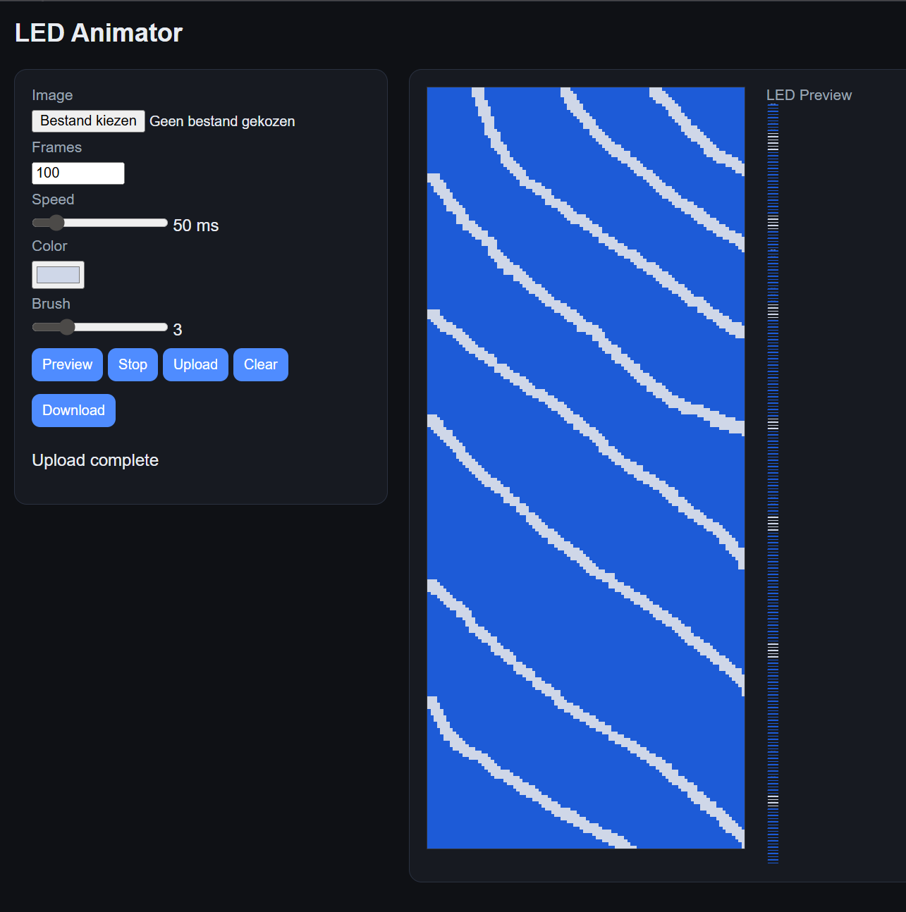

# LED Animator

Paint LED animations in your browser and play them live on a NeoPixel strip via ESP32.

Instead of hand-coding LED sequences, you simply paint on a canvas — the **X axis is time, the Y axis is your LEDs**. Upload with one click and the ESP32 handles the rest.

Inspired by the light effects in the Iron Man attraction at Disneyland Paris.

---

## How it works

The ESP32 hosts a small web interface over WiFi. You open it in your browser, draw or load an image onto the canvas, set your playback speed, and hit Upload. The animation is stored in flash and played back column by column in real time — each column of pixels becomes one frame on the LED strip.



---

## Features

- Browser-based canvas editor — draw directly or load any image
- Adjustable playback speed
- Live LED preview in the browser before uploading
- Stores animation in flash — survives power cycles
- Loads full animation into RAM for smooth, jitter-free playback
- Download/save your animations as PNG files
- Self-hosted — no cloud, no app, just your local WiFi

---

## Hardware

| Component | Details |
|---|---|
| Microcontroller | ESP32 |
| LED strip | SK6812 RGBW NeoPixel, 240 LEDs |
| Data pin | GPIO 5 |
| Power | 5V, make sure your power supply can handle the strip |

> The code uses the I2S peripheral on the ESP32 for driving the signal, which avoids timing issues caused by WiFi interrupts.

---

## Software dependencies

- [ESPAsyncWebServer](https://github.com/me-no-dev/ESPAsyncWebServer)
- [NeoPixelBus](https://github.com/Makuna/NeoPixelBus)
- LittleFS (built into ESP32 Arduino core)

---

## Getting started

1. Clone this repo
2. Open the project in Arduino IDE or PlatformIO
3. Set your WiFi credentials in the sketch:
   ```cpp
   const char* ssid     = "your-network";
   const char* password = "your-password";
   ```
4. Flash to your ESP32
5. Open the Serial Monitor to find the IP address
6. Navigate to that IP in your browser

---

## Usage

1. **Draw** on the canvas with the color picker and brush tool, or **load an image** from disk
2. Set the **frame width** (number of columns = number of frames)
3. Adjust the **speed** slider
4. Hit **Preview** to see a simulation in the browser LED panel
5. Hit **Upload** to send to the ESP32
6. The strip starts playing immediately and will resume after a reboot

---

## Animation format

Animations are stored as a simple binary file (`image.bin`) in LittleFS:

| Bytes | Content |
|---|---|
| 0–1 | Width (number of frames) |
| 2–3 | Height (number of LEDs, max 240) |
| 4–5 | Speed in milliseconds |
| 6+ | Raw RGB pixel data, row by row |

---

## Notes

- The strip is driven as **RGBW** — the white channel is extracted from the RGB values at runtime using `min(r, g, b)`
- The full animation is loaded into RAM on startup for fast column access
- Maximum animation width is 150 frames (configurable, should not exceed 150 otherwise the esp32 will crash)

---

## License

MIT © 2025 Rutgeerts consulting

---

## Acknowledgements

- Inspired by the Iron Man Experience at Disneyland Paris
- Built with [NeoPixelBus](https://github.com/Makuna/NeoPixelBus) by Makuna
- Web server by [ESPAsyncWebServer](https://github.com/me-no-dev/ESPAsyncWebServer)